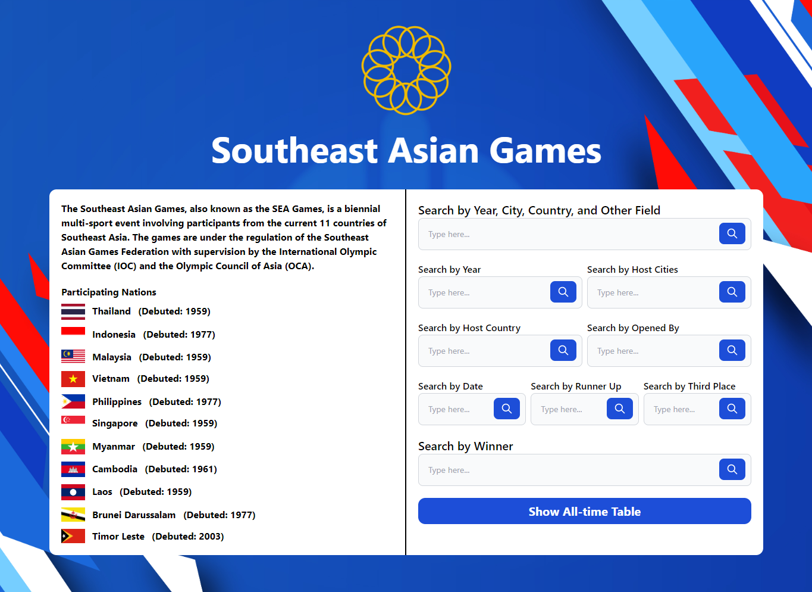

# Sea Games App

This repository is a final project from Semantic Web Class, Teknik Informatika Universitas Padjadjaran.

**Sea Games App adalah aplikasi berbasis website yang bertujuan untuk menampilkan data setiap edisi dari Sea Games**

## Credits

| NPM          | Nama                           |
| ------------ | ------------------------------ |
| 140810190005 | Mohamad Fahrio Ghanial Fatihah |

## Menjalankan Aplikasi
1. Install dan jalankan server Apache Jena Fuseki
2. Buat dataset baru dengan nama "seagames" tanpa kutip
3. Upload data untuk dataset seagames tersebut dengan memilih file seagames.ttl yang terdapat di public/Sea Games RDF/
4. Clone repo ini, buka CLI lalu ketikkan command dibawah untuk menginstal dependencies yang dibutuhkan
    ```
    npm install
    ```
5. Buat production build aplikasi dengan command
    ```
    npm run build
    ```
6. Jalankan aplikasi dengan command
    ```
    npm start
    ```
7. Aplikasi dapat dibuka di browser pada http://localhost:3000/

## Tampilan Aplikasi

